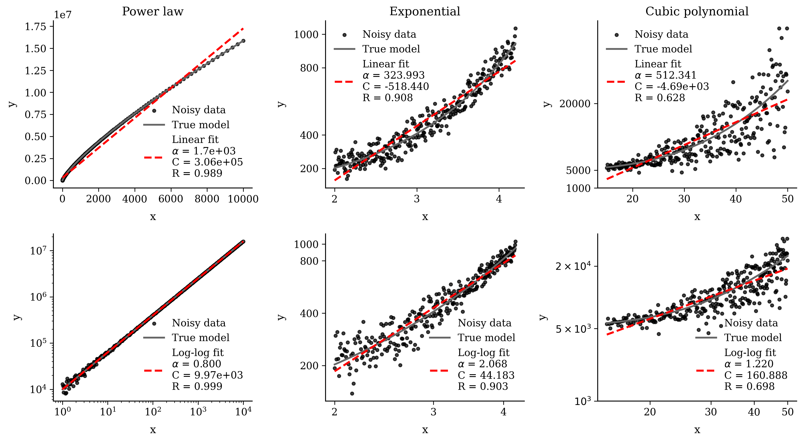

# Every log-log plot is a straight line (almost)

Compact, reproducible companion repository for the Medium post on how smooth non-power-law curves can look deceptively linear on log-log axes over finite intervals.



## What the notebook contains

The notebook builds and compares three synthetic cases under additive Gaussian noise:

- Case A: true power law (control)
- Case B: exponential model
- Case C: cubic polynomial model

For each case, it shows:

- linear axes vs log-log axes
- naive linear fit in original space
- linear fit in log-log space
- a final summary figure that compares all three side by side

## How to run

1. Install dependencies:

```bash
pip install -r requirements.txt
```

2. Open and run the notebook:

```bash
jupyter notebook notebooks/loglog_illusion.ipynb
```

3. Run the final export cell to regenerate:

- `assets/loglog_powerlaw_fit.png`
- `assets/loglog_exponential_fit.png`
- `assets/loglog_cubic_fit.png`
- `assets/loglog_summary_cases.png`
- `notebooks/loglog_illusion.html`

## Note

This repository is intended as a lightweight, reproducible visual companion to the Medium article, not as a full methodological paper.
